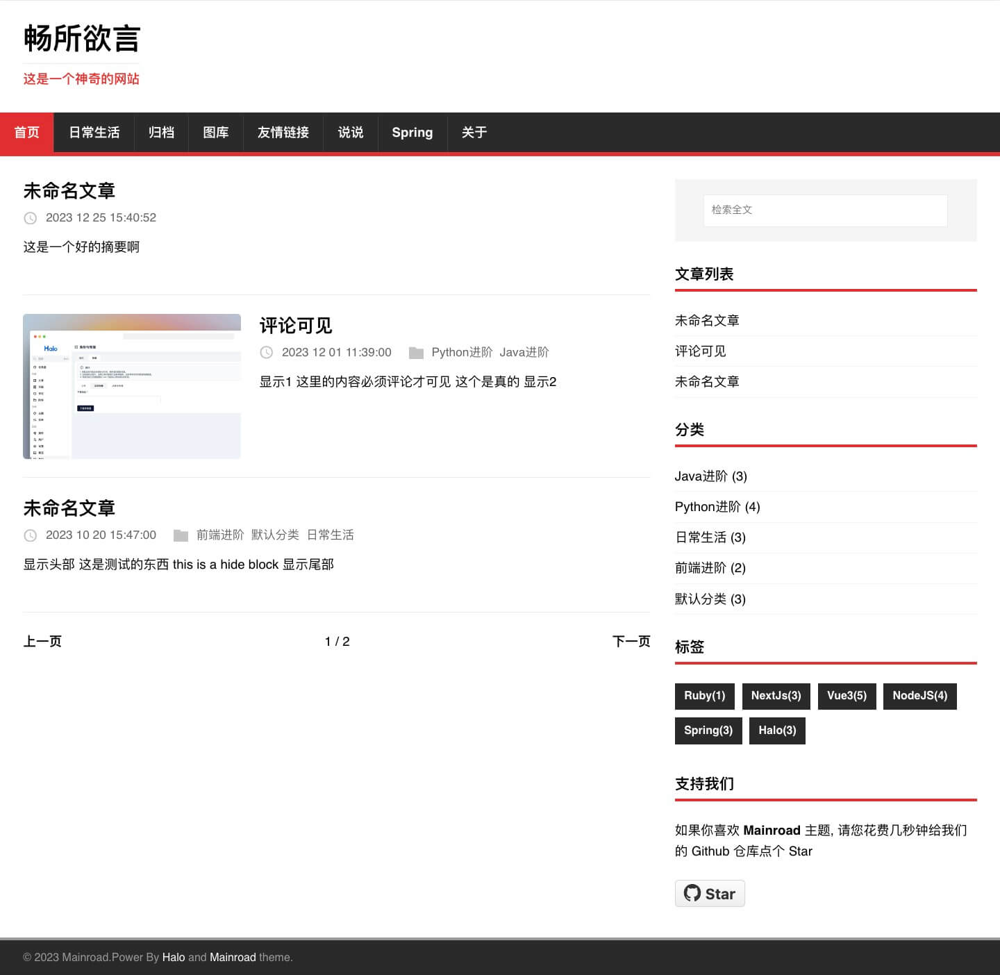
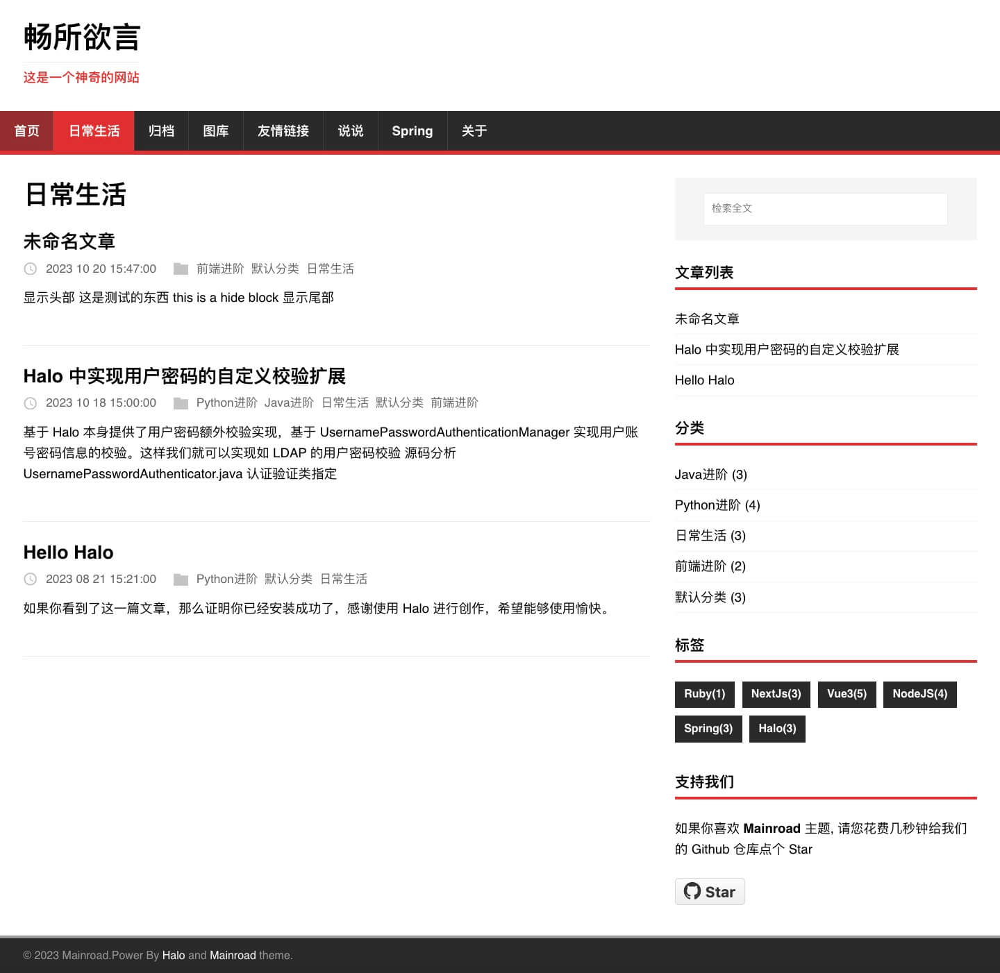
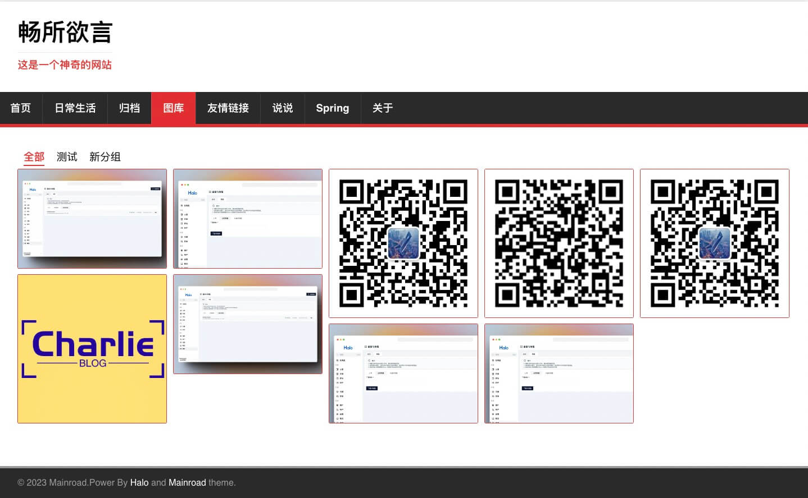
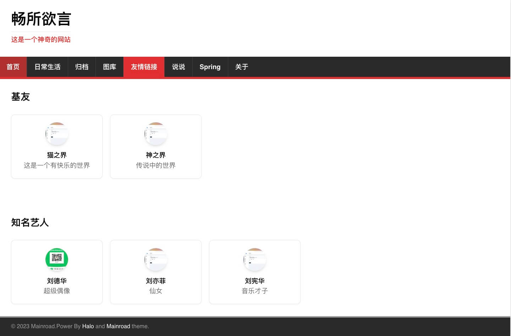
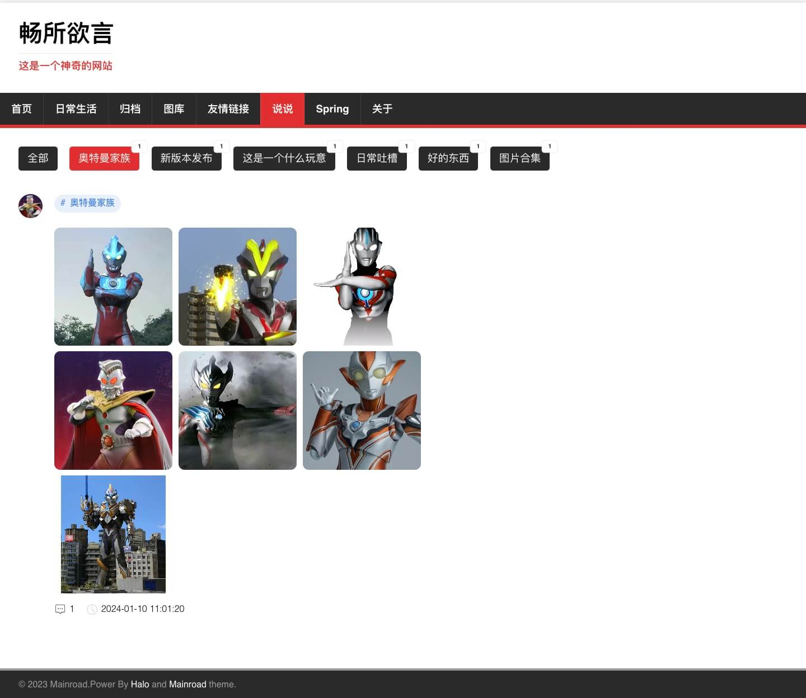
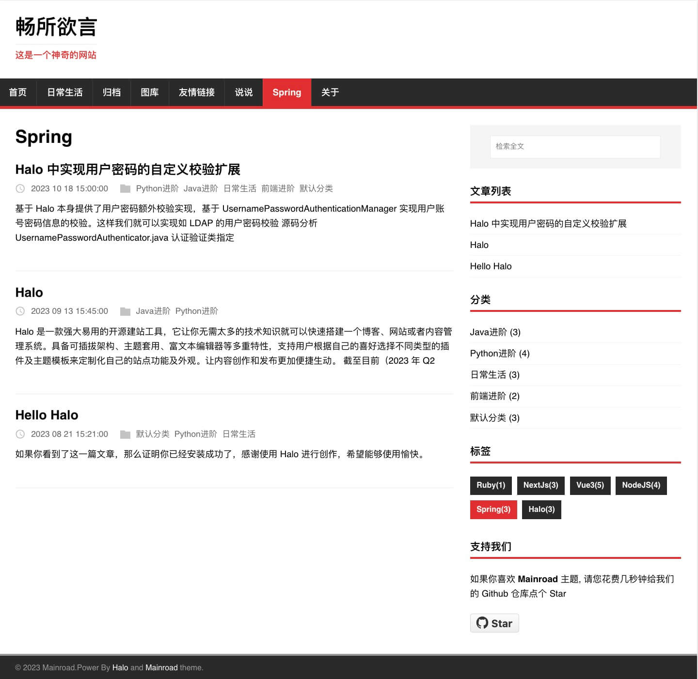

# Mainroad

**Mainroad** 是一个响应式、简单、干净且以内容为中心的[halo](https://halo.run/) 主题是基于
[Vimux Mainroad](https://github.com/Vimux/Mainroad) 改造而来.

**特征:**

+ 响应式设计
+ 自定义菜单
+ [支持评论](https://github.com/halo-dev/plugin-comment-widget)
+ [支持搜索](https://github.com/halo-dev/plugin-search-widget)
+ [支持友链](https://github.com/halo-sigs/plugin-links)
+ [支持图库](https://github.com/halo-sigs/plugin-photos)
+ [支持瞬间](https://github.com/halo-sigs/plugin-moments)

## 预览

**预览地址:**
https://www.wggznb.top/?preview-theme=theme-mainroad

## 安装

下载 Release zip，在 Halo 的主题菜单下进行安装启用即可。

## 配置

### 配置页面

## 代码贡献

您是否发现了错误或对新功能有了想法？请随时使用
[issue tracker](https://github.com/liuchangfitcloud/theme-mainroad/issues) 让我知道. 或者直接提交[pull request](https://github.com/liuchangfitcloud/theme-mainroad/pulls)

## License

主题遵循 [GPLv2 license](https://github.com/liuchangfitcloud/theme-mainroad/blob/master/LICENSE.md).